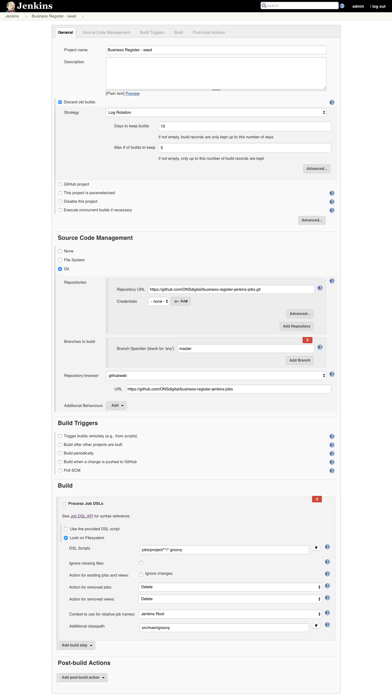

# Overview

This project generates Jenkins configuration for Business Register project using [Jenkins DSL Plugin](https://wiki.jenkins-ci.org/display/JENKINS/Job+DSL+Plugin).

# Requirements

Following plugins are required to be installed on Jenkins instance:

- [Job DSL plugin](https://wiki.jenkins-ci.org/display/JENKINS/Job+DSL+Plugin)
- [Folders plugin](https://wiki.jenkins-ci.org/display/JENKINS/CloudBees+Folders+Plugin)
- [GitHub plugin](http://wiki.jenkins-ci.org/display/JENKINS/Github+Plugin)

# Getting started 

## How to configure SEED job 

Before Jenkins configuration can be generated from the source code the SEED job has to be created manually. That particular job will:

- checkout source code of this project from GitHub repository
- generate CI configuration for Business Register project

Sample job configuration is presented below:

.

## How to generate CI configuration

When SEED job is configured then generating CI configuration for Business Register project is as simple as clicking 'Build Now' button.

Triggered build should complete successfully but sometimes it might become unstable because of missing plugins. In such scenario build logs will indicate what has to be installed. 

## What will get created

When SEED build succeeds it will create 'Business Register' directory. That directory will contain all jobs and views related to the Business Register project.